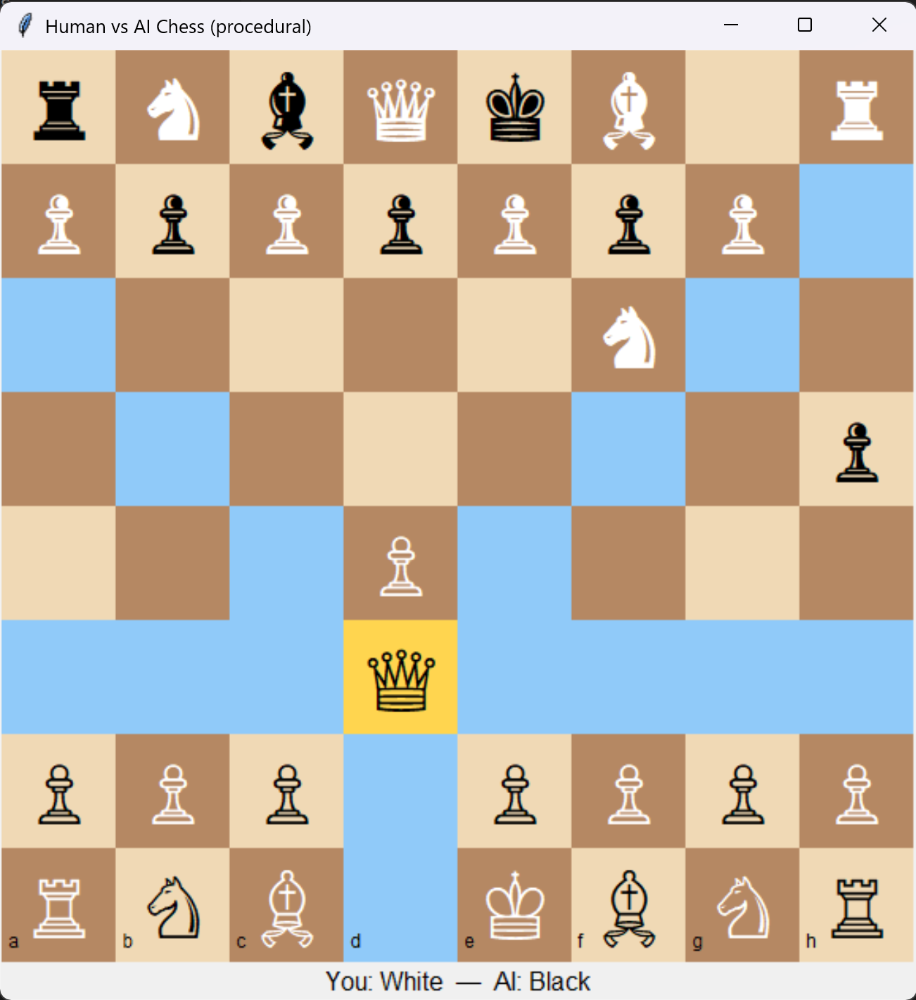

# Human vs AI Chess Game (Python Tkinter)

A desktop-based chess game where you play as White against an AI opponent that uses the Minimax algorithm with Alpha-Beta pruning. The AI difficulty can be set by changing the search depth.

## How to Run

### Method 1: Terminal / Command Line

1. Ensure Python 3.8+ is installed
2. Install required library:
   pip install python-chess
3. Download or clone the project files
4. Navigate to the project folder
5. Run the game:
   python chess-ai.py

### Method 2: IDE

1. Open chess.py in your Python IDE (VS Code, PyCharm, etc.)
2. Run the script (F5 / Run button)
3. The game window will appear, and you play as White

## Prerequisites

- Python 3.8+
- Tkinter (comes with standard Python installation)
- python-chess library:
  pip install python-chess
- No other dependencies

## How to Play

- You play as White, AI plays as Black
- Objective: Checkmate the opponent's king
- Select a piece by clicking it; valid moves will be highlighted
- Click on a highlighted square to move the piece
- AI automatically responds after your move

### Basic Rules

- **Objective**: Checkmate the opponent's king
- **You play as White** and always move first
- **AI plays as Black** and responds to your moves

### Making Moves

1. **Select a Piece**: Click on any of your white pieces
2. **See Valid Moves**: Legal moves are highlighted with small dots
3. **Make Your Move**: Click on any highlighted square to move your piece
4. **AI Response**: The AI will automatically make its move after yours

### Special Rules

- Pawn Promotion: Pawns reaching the last rank prompt you to choose promotion (q/r/b/n)
- Check Detection: Illegal moves that leave the king in check are not allowed
- Checkmate & Stalemate: Game ends appropriately
- Draws: Insufficient material or claimable draws are handled

## Algorithm Used

This chess game implements a sophisticated AI using the **Minimax Algorithm with Alpha-Beta Pruning**.

### Minimax Algorithm

The core AI decision-making algorithm that:

- **Creates a game tree** of possible moves up to a specified depth (1-3 moves ahead)
- **Alternates between players**: AI tries to maximize score, Human tries to minimize score
- **Evaluates positions** recursively until maximum depth is reached
- **Selects the best move** based on the assumption that both players play optimally

### Alpha-Beta Pruning

An optimization technique that:

- **Reduces search time** by eliminating branches that won't affect the final decision
- **Produces identical results** to pure minimax but significantly faster
- **Allows deeper search** in the same amount of time
- **Improves performance** from O(b^d) to O(b^(d/2)) in best case

### Position Evaluation

The AI evaluates chess positions using:

- **Material Count**: Assigns point values to pieces (Pawn: 100, Knight: 320, Bishop: 330, Rook: 500, Queen: 900, King: 2000)
- **Score Calculation**: AI pieces add to score, Human pieces subtract from score
- **Random Factor**: Small random element prevents repetitive play

### Algorithm Complexity

- **Time Complexity**: O(b^d) where b ≈ 35 (average chess branching factor), d = depth
- **With Alpha-Beta**: Average case O(b^(d/2)), significantly faster
- **Adjustable Difficulty**: Depth parameter (1-3) controls AI strength

## Screenshots

Below are screenshots showing the chess game in action:

### Main Game Interface

_The main game interface showing the chess board with pieces in starting position_

### Key Features Shown

- **Clean Interface**: Modern, intuitive design
- **Visual Feedback**: Selected pieces highlighted, valid moves marked with dots
- **Status Updates**: Clear indication of game state and whose turn it is
- **Responsive Design**: Works well on different screen sizes
- **Professional Appearance**: Uses Unicode chess symbols for authentic look

_Note: Screenshots are stored in the `screenshots` folder within the project directory._

---

## Additional Resources

For detailed technical documentation, implementation details, and advanced topics, see:

- **[DETAILED_GUIDE.md](DETAILED_GUIDE.md)** - Comprehensive technical documentation with code explanations, advanced AI techniques, and implementation details.
