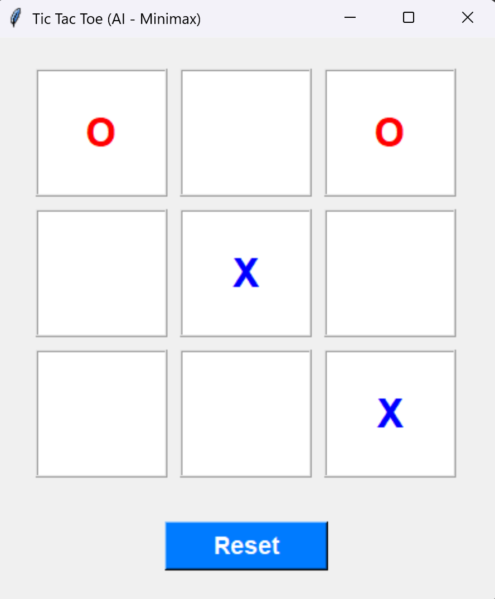

## Tic Tac Toe with AI (Python - Tkinter)

A classic Tic Tac Toe game where you play against an unbeatable AI opponent using the Minimax algorithm, implemented in Python with `tkinter`.

## How to Run the Game

1. **Download the files**: Ensure you have all the game files in the correct folder structure:

   - `tic-tac-toe.py` (main Python file)
   - `README.md` (this file)
   - `screenshots/` (folder containing `tic-tac.png` screenshot)

2. **Run the Python file**: Open a terminal or command prompt and run:

   ```bash
   python tic-tac-toe.py
Ensure you have **Python 3.x** installed.

3. **Start playing**: The game window will open automatically and display a 3x3 grid.

## Prerequisites

**Python Installation Required!** This game runs on Python with `tkinter`:

* **Python 3.x** (download from [python.org](https://www.python.org/))
* `tkinter` (usually included by default with Python)

**OS Compatibility:**

* Works on Windows, macOS, and Linux
* GUI powered by Tkinter

## How to Play

1. **Make Your Move**: You play as "X" — click on any empty cell to place your mark.
2. **AI Response**: The computer plays as "O" and will automatically make its move after you.
3. **Win Condition**: Get three of your marks in a row (horizontal, vertical, or diagonal) to win.
4. **Draw Condition**: If all cells are filled and no one wins, the game is a draw.
5. **Game Controls**:

   * **Reset Button**: Start a new round (clears the board).

**Controls:**

* **Mouse Click**: Click on empty cells to make moves
* **Reset Button**: Clear the current game board

## Algorithms Used

This game implements several important algorithms and programming concepts:

1. **Minimax Algorithm**:

   * **Purpose**: Ensures the AI makes optimal moves
   * **How it works**: Recursively evaluates all possible future game states
   * **Result**: The AI is unbeatable — best you can achieve is a draw
   * **Time Complexity**: O(b^d), where b is branching factor (available moves) and d is depth (remaining moves)

2. **Game Tree Search**:

   * **Depth-First Search**: Explores game states recursively
   * **Backtracking**: Undoes moves to explore other possibilities

3. **Game State Management**:

   * **State Representation**: 1D array representing the 3x3 board
   * **Win Detection**: Pattern matching against winning combinations
   * **Turn Management**: Alternates between human and AI players

4. **Event-Driven Programming**:

   * **Tkinter Event Handling**: Responds to user clicks on buttons
   * **Asynchronous Updates**: Updates GUI based on game state changes

---

### Main Game Interface



*The main game window showing a 3x3 grid with X's and O's in play.*

* Player moves are shown in **blue**
* AI moves are shown in **red**
* Board buttons highlight available cells
* Reset button clears the board

### Key Features Shown

* **Clean Interface**: Simple, intuitive design with clear visual feedback
* **Interactive Grid**: 3x3 board, clickable cells
* **Game Controls**: Reset button for easy game management
* **AI Opponent**: Unbeatable AI using Minimax
* **Real-Time Feedback**: Message boxes notify wins, losses, or draws

*Note: Screenshots are stored in the `Screenshots` folder within the project directory.*

---

**For detailed implementation guide and code explanations, see [DETAILED_GUIDE.md](DETAILED_GUIDE.md)**

