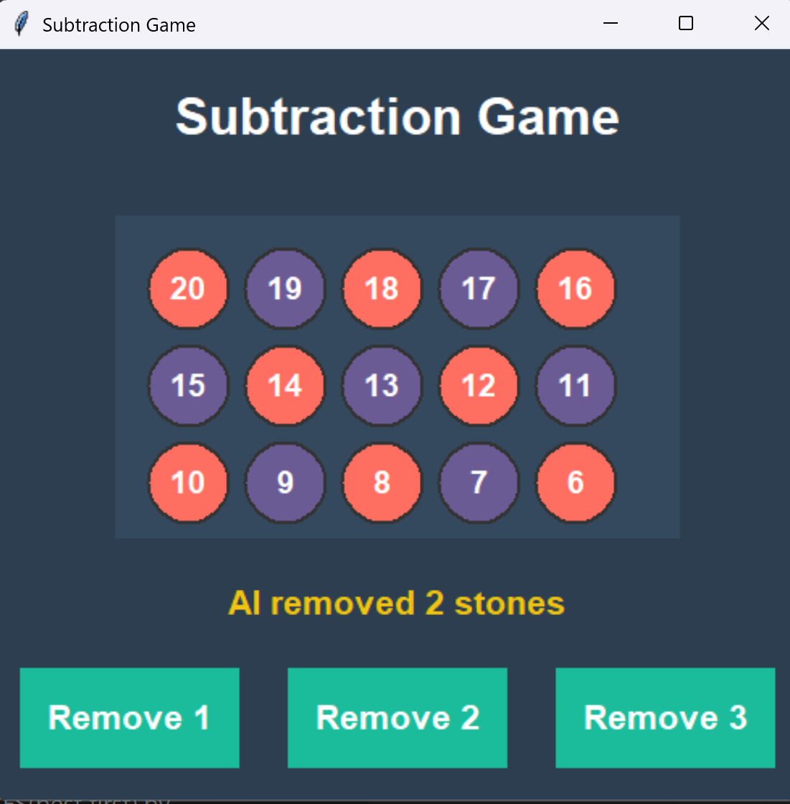

# Subtraction Game (Stones Game) - Python Tkinter

A classic subtraction game where you play against an AI opponent using the Minimax algorithm, implemented in Python with `tkinter`. Players take turns removing **1–3 stones** from a pile. The player who removes the **last stone wins**.

---

## How to Run the Game

1. **Download the files**: Ensure you have all the game files in the correct folder structure:

   - `two player subtraction.py` (main Python file)  
   - `README.md` (this file)  
   - `screenshots/` (optional folder containing screenshots of gameplay)

2. **Run the Python file**: Open a terminal or command prompt and run:

   ```bash
   python two player subtraction.py
Ensure you have **Python 3.x** installed.

3. **Start playing**: The game window will open automatically and display the stones and move buttons.

---

## Prerequisites

**Python Installation Required!** This game runs on Python with `tkinter`:

* **Python 3.x** ([Download here](https://www.python.org/))
* `tkinter` (usually included by default with Python)

**OS Compatibility:**

* Works on Windows, macOS, and Linux
* GUI powered by Tkinter

---

## How to Play

1. **Player Move**: Click the button to remove **1, 2, or 3 stones** from the pile.
2. **AI Response**: The AI will automatically make its move using the Minimax algorithm.
3. **Win Condition**: The player who removes the **last stone wins**.
4. **Invalid Move**: You cannot remove more stones than remain in the pile.

**Controls:**

* **Mouse Click**: Click on the buttons to remove stones
* **Game Restart**: Close and re-run the game to play again

---

## Algorithms Used

This game implements several important algorithms and programming concepts:

1. **Minimax Algorithm**:

   * **Purpose**: Ensures the AI makes optimal moves
   * **How it works**: Recursively evaluates all possible future states of the game
   * **Result**: The AI is unbeatable — if played perfectly, the human cannot win
   * **Time Complexity**: O(b^d), where b = 3 (possible moves), d = remaining stones

2. **Game Tree Search**:

   * **Depth-First Search**: Explores all possible moves recursively
   * **Backtracking**: Undoes moves to evaluate other options

3. **Game State Management**:

   * **State Representation**: Single integer representing remaining stones
   * **Turn Management**: Alternates between human and AI players
   * **Move Validation**: Ensures moves are valid before updating game state

4. **Event-Driven Programming**:

   * **Tkinter Event Handling**: Responds to user clicks on buttons
   * **Asynchronous Updates**: Updates GUI and AI moves automatically

---

## Main Game Interface



*The main game window showing remaining stones as colored circles and move buttons.*

* Player moves are shown by reducing the stone count
* AI moves are displayed with a message label
* Buttons allow removing 1, 2, or 3 stones

---

## Key Features

* **Clean Interface**: Minimalist, intuitive GUI with clear feedback
* **Interactive Gameplay**: Clickable buttons for player moves
* **AI Opponent**: Unbeatable AI powered by Minimax
* **Real-Time Feedback**: Updates stone display and AI moves
* **Customizable Stones**: Easily change starting number of stones in code

*Note: Screenshots are stored in the `Screenshots` folder within the project directory.*

---

**For detailed implementation guide, code explanation, and AI walkthrough, see [DETAILED_GUIDE.md](DETAILED_GUIDE.md)**

