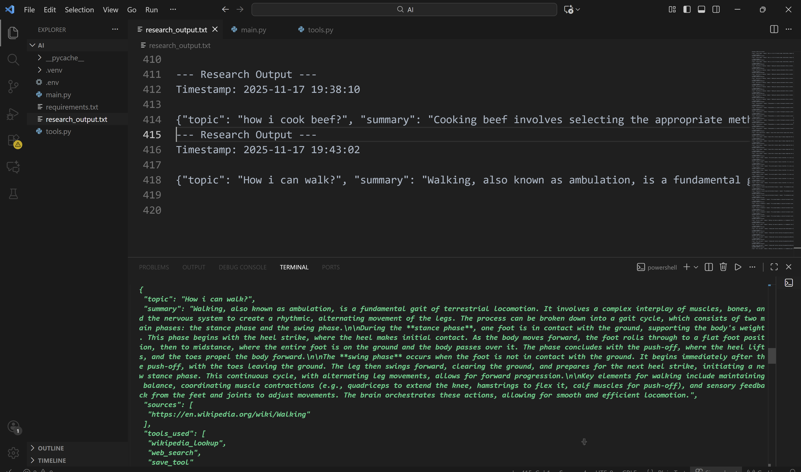

# LangChain Research Agent

## Overview

This project implements a **Python-based research agent** using **LangChain** and **Google Gemini AI**. The agent accepts a research query, uses external tools like `web_search` and `wikipedia_lookup` to gather information, and outputs a **structured JSON response**. The final result is saved automatically using a `save_tool`.

Key highlights:

- Fully structured outputs using **Pydantic models**.
- Multi-step reasoning using **ReAct agent pattern**.
- Automatic saving of research results.
- Easy integration with additional tools or LLMs.
- Professional, step-by-step traceable agent execution.

---

## Features

1. **Structured Research Response**

   The agent always returns:

   ```json
   {
     "topic": "Exact user query",
     "summary": "Concise summary of findings",
     "sources": ["URL1", "URL2"],
     "tools_used": ["web_search", "wikipedia_lookup", "save_tool"]
   }


2. **Multi-Step Reasoning**

   Uses the **ReAct framework** to:

   * Think about actions.
   * Select the appropriate tool.
   * Gather observations.
   * Summarize and save the final result.

3. **Automatic Saving**

   The final structured output is automatically saved to `research_output.txt` by `save_tool`.

4. **Intermediate Steps Logging**

   Verbose mode allows inspection of every step the agent takes.

---

## Requirements

### Python Version

* Python 3.10 or higher

### Dependencies

Install via `requirements.txt`:

```bash
pip install -r requirements.txt
```

**Example `requirements.txt`:**

```
python-dotenv
pydantic
langchain
langchain-google-genai
```

### Environment Variables

Create a `.env` file in the project root:

```
GOOGLE_API_KEY=your_google_gemini_api_key_here
```

---

## Project Structure

```
.
├── README.md
├── main.py                # Entry point for the agent
├── tools.py               # Contains search_tool, wiki_tool, save_tool
├── research_output.txt    # Output file where results are saved
├── input.png              # Example user input image
├── response.png           # Example response image
├── .env                   # Environment variables
└── requirements.txt
```
## How It Works

1. **Load Environment Variables**

   ```python
   load_dotenv()
   ```

2. **Define Structured Output Schema**

   ```python
   class ResearchResponse(BaseModel):
       topic: str
       summary: str
       sources: list[str]
       tools_used: list[str]
   ```

3. **Initialize LLM and Output Parser**

   ```python
   llm = ChatGoogleGenerativeAI(model="gemini-2.5-flash", temperature=0)
   parser = PydanticOutputParser(pydantic_object=ResearchResponse)
   ```

4. **Define ReAct Prompt**

   The prompt guides the agent to:

   * Use available tools.
   * Think, act, observe in multiple steps.
   * Save the final result in structured JSON.

5. **Create Agent Executor**

   ```python
   agent_executor = AgentExecutor(
       agent=agent, 
       tools=tools, 
       verbose=True,
       return_only_outputs=True, 
       handle_parsing_errors=True, 
       return_intermediate_steps=True,
       stop=["Observation: Data successfully saved to research_output.txt"]
   )
   ```

6. **Execute the Agent**

   ```python
   query = input("What can I help you research? ")
   raw_response = agent_executor.invoke({
       "query": query,
       "agent_scratchpad": "",
       "chat_history": "",
   })
   ```

7. **Parse and Display Structured Response**

   ```python
   structured_response = parser.parse(raw_response.get("output"))
   print(structured_response.model_dump_json(indent=2))
   ```

---

## Example Usage

```bash
python main.py
```

**Sample Input:**

```
What is the capital of Bangladesh?
```

**Sample Output:**

```json
{
  "topic": "What is the capital of Bangladesh?",
  "summary": "The capital of Bangladesh is Dhaka, a major city in South Asia known for its vibrant culture.",
  "sources": ["https://en.wikipedia.org/wiki/Dhaka"],
  "tools_used": ["wikipedia_lookup", "save_tool"]
}
```

---

## Screenshots

**User Input Example:**


**Agent Response Example:**



---

## Extending the Agent

* **Add new tools**: Simply define the tool in `tools.py` and include it in the `tools` list.
* **Change LLM model**: Update `ChatGoogleGenerativeAI(model="...")` with the desired model.
* **Customize output schema**: Modify `ResearchResponse` to include additional fields like `images`, `tables`, etc.

---

## Notes

* Always ensure `GOOGLE_API_KEY` is valid.
* Verbose logging helps debug multi-step ReAct reasoning.
* Structured output ensures downstream processing is easy and reliable.

